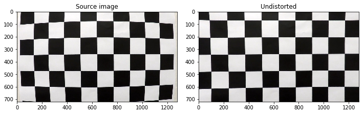
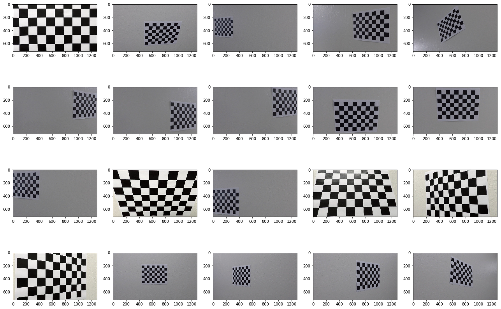
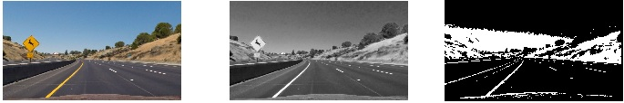
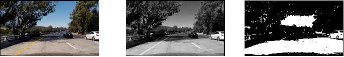
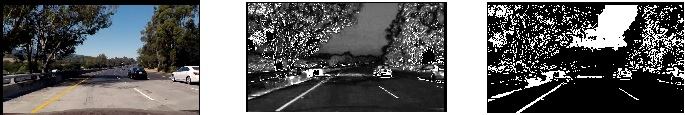
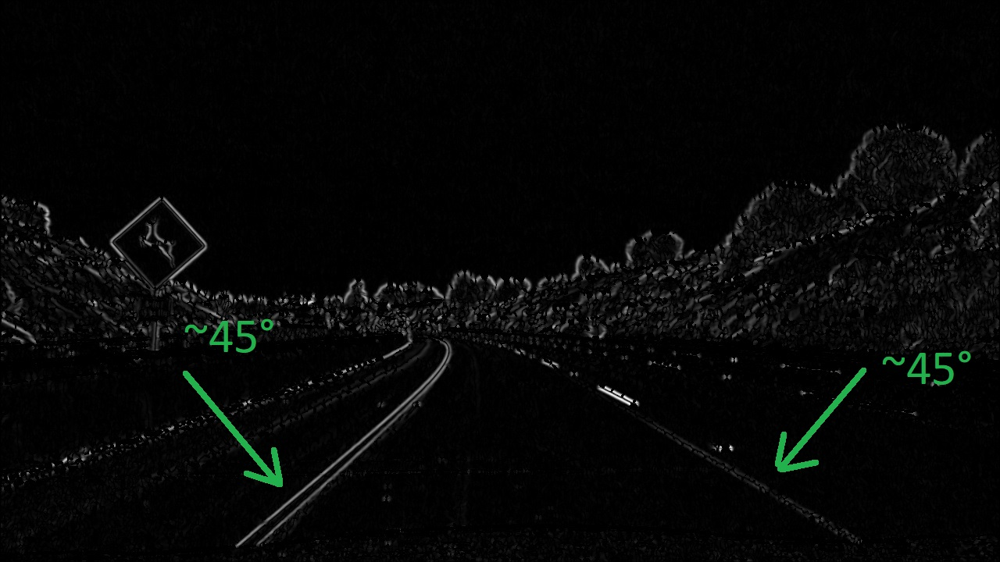
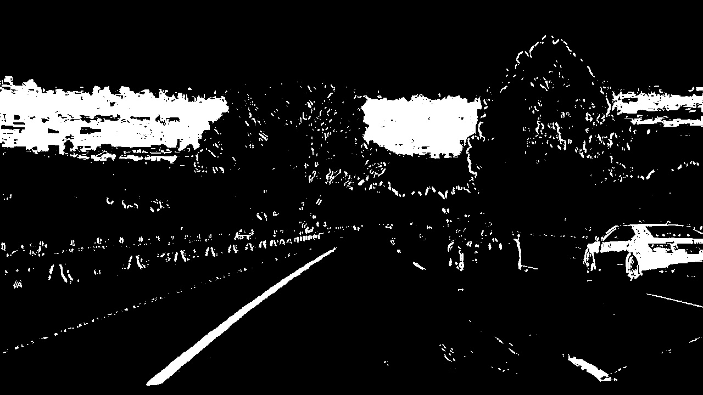

## Advanced Lane Finding Project ##

The goals / steps of this project are the following:
1. Compute the camera calibration matrix and distortion coefficients given a set of chessboard images.
2. Apply a distortion correction to raw images.
3. Use color transforms, gradients, etc., to create a thresholded binary image.
4. Apply a perspective transform to rectify binary image ("birds-eye view").
5. Detect lane pixels and fit to find the lane boundary.
6. Determine the curvature of the lane and vehicle position with respect to center.
7. Warp the detected lane boundaries back onto the original image.
8. Output visual display of the lane boundaries and numerical estimation of lane curvature and vehicle position.
9. Genrate video with the pipeline designed above.

The code is stored in Jupyter Notebook named "project.ipynb" and has exactly the same topic numeration.

 ### 1. First, I'll compute the camera calibration using chessboard images ###
 
 Project contains sample images of a chessboard taken with the car camera. OpenCV function findChessboardCorners finds corners and returns them as array. These image points should match reference object points. The grid of object points is generated with numpy function mgrid.
 
 List of ideal object points and the list of real image points captured by camera are then passed to the OpenCV function calibrateCamera that automatically calculates transformation tht should compensate camera lens distortion.
 
 The transformation matrix is stored in Python variable "mtx" for following calculations.
 
 Here is the result of distortion compensation:
 

2 of 20 images have slightly different sizes and were discarded. 
 

## 2. Apply a distortion correction to raw images. ##

To test the distortion compensation matrix I applied to all 20 images provided with the project and teh result looks pretty well:

## 3. Use color transforms, gradients, etc., to create a thresholded binary image. ##

That was the most difficult part of the project for me. Images in project video have white and yellow marker lines filmed in varying lighting conditions on different source types.

First I extract information from classical RGB and Grayscale channels. 

The R channel is good to find both white and yellow lines on a dark surface. After applying simple threshold I get clear lines on binary image:

Unfortunately it does now work so well on bright parts of the road:

Still the R channel will be useful, so I extract it and transform to binary mask with threshold 128.

Next source of information is the S channel of HLS color space. The channel contains color information and is not so affected by light and shadows:

To make picture more contrast I first do histogram equalization with a function from OpenCV library.
Then it 's also converted to binary mask with the same threshold value 128.

The S channel can also have false positive pixels in shadow but they do not correlate with false positives in red channel.

To filter out these false positives I do bitwise AND operation of binary R and S channels. That gives me white pixels only in places where both R and S have values above the threshold.
That's done in Python function "combine_and", source code block 3.

That mask has almost no false white pixels, but sometimes also drops the right line that has white color and looks pretty dark in S channel.

Next step is to add pixels using gradient detection. First I apply Sobel operator in X and Y directions and then calculate the full gradient in diagonal direction. I have chosen diagonal direction because for the further line detection it is important to have clear lines in the bottom part of the image and these lines are almost diagonal:

To calculate it I add gradients in X and Y direction multiplied by sqrt(2)/2.

I also calculate the slope of the gradient vector to filter out almost horizontal lines. Here I had a bug that cost me a lot of time: I mistakenly dropped values with angle below 30 degrees. The right solution is to drop points with gradient with angles > 60 degrees because near horizontal lines have almost vertical gradient with angle close to 90 (or pi/2 in radian).

That's all done in function  gradient_xy, code block 3.1.

I already used data from R and S channels above, so I decided to calculate gradient of L channel in the HLS color space.

Even after normalization into range 0..255 the gradient values can vary a lot, so I apply a much lower threshold 60 to convert it to binary mask.

Finally I combine it using OR bitwise operator with the R AND S bit mask calculated before.

### Summary ###           
1. Apply threshold to R channel in RGB color space
2. Histogram correction of S channel in HLS color space
3. Apply threshold to step 2 output
4. Bitwise AND combination of steps 1 (R) and 3 (S)
5. Calculate diagonal gradient of L channel in HLS color space
6. Drop points having almost vertical gradient (horizontal lines)
7. Apply threshold to step 6 output
8. Bitwise OR combination of steps 4 and 6

See process_image function in code block 3.3.

To test it I applied the function to all test images and got the following result:
<table>
<tr><td></td><td></tr>
</table>

  

            