## Advanced Lane Finding Project ##

The goals / steps of this project are the following:
1. Compute the camera calibration matrix and distortion coefficients given a set of chessboard images.
2. Apply a distortion correction to raw images.
3. Use color transforms, gradients, etc., to create a thresholded binary image.
4. Apply a perspective transform to rectify binary image ("birds-eye view").
5. Detect lane pixels and fit to find the lane boundary.
6. Determine the curvature of the lane and vehicle position with respect to center.
7. Warp the detected lane boundaries back onto the original image.
8. Output visual display of the lane boundaries and numerical estimation of lane curvature and vehicle position.
9. Generate video with the pipeline designed above.

The code is stored in Jupyter Notebook named "project.ipynb" and has exactly the same topic numeration.

 ### 1. First, I'll compute the camera calibration using chessboard images ###
 
 Project contains sample images of a chessboard taken with the car camera. OpenCV function findChessboardCorners finds corners and returns them as array. These image points should match reference object points. The grid of object points is generated with numpy function mgrid.
 
 List of ideal object points and the list of real image points captured by camera are then passed to the OpenCV function calibrateCamera that automatically calculates transformation tht should compensate camera lens distortion.
 
 The transformation matrix is stored in Python variable "mtx" for following calculations.
 
 Here is the result of distortion compensation:
 

2 of 20 images have slightly different sizes and were discarded. 
 

## 2. Apply a distortion correction to raw images. ##

To test the distortion compensation matrix I applied to all 20 images provided with the project and teh result looks pretty well:

## 3. Use color transforms, gradients, etc., to create a thresholded binary image. ##

That was the most difficult part of the project for me. Images in project video have white and yellow marker lines filmed in varying lighting conditions on different source types.

First I extract information from classical RGB and Grayscale channels. 

The R channel is good to find both white and yellow lines on a dark surface. After applying simple threshold I get clear lines on binary image:

Unfortunately it does now work so well on bright parts of the road:

Still the R channel will be useful, so I extract it and transform to binary mask with threshold 128.

Next source of information is the S channel of HLS color space. The channel contains color information and is not so affected by light and shadows:

To make picture more contrast I first do histogram equalization with a function from OpenCV library.
Then it 's also converted to binary mask with the same threshold value 128.

The S channel can also have false positive pixels in shadow but they do not correlate with false positives in red channel.

To filter out these false positives I do bitwise AND operation of binary R and S channels. That gives me white pixels only in places where both R and S have values above the threshold.
That's done in Python function "combine_and", source code block 3.

That mask has almost no false white pixels, but sometimes also drops the right line that has white color and looks pretty dark in S channel.

Next step is to add pixels using gradient detection. First I apply Sobel operator in X and Y directions and then calculate the full gradient in diagonal direction. I have chosen diagonal direction because for the further line detection it is important to have clear lines in the bottom part of the image and these lines are almost diagonal:

To calculate it I add gradients in X and Y direction multiplied by sqrt(2)/2.

I also calculate the slope of the gradient vector to filter out almost horizontal lines. Here I had a bug that cost me a lot of time: I mistakenly dropped values with angle below 30 degrees. The right solution is to drop points with gradient with angles > 60 degrees because near horizontal lines have almost vertical gradient with angle close to 90 (or pi/2 in radian).

That's all done in function  gradient_xy, code block 3.1.

I already used data from R and S channels above, so I decided to calculate gradient of L channel in the HLS color space.

Even after normalization into range 0..255 the gradient values can vary a lot, so I apply a much lower threshold 60 to convert it to binary mask.

Finally I combine it using OR bitwise operator with the R AND S bit mask calculated before.

### Summary ###           
1. Apply threshold to R channel in RGB color space
2. Histogram correction of S channel in HLS color space
3. Apply threshold to step 2 output
4. Bitwise AND combination of steps 1 (R) and 3 (S)
5. Calculate diagonal gradient of L channel in HLS color space
6. Drop points having almost vertical gradient (horizontal lines)
7. Apply threshold to step 6 output
8. Bitwise OR combination of steps 4 and 6

See process_image function in code block 3.3.

To test it I applied the function to all test images and got the following result:
<table>
<tr><td></td><td>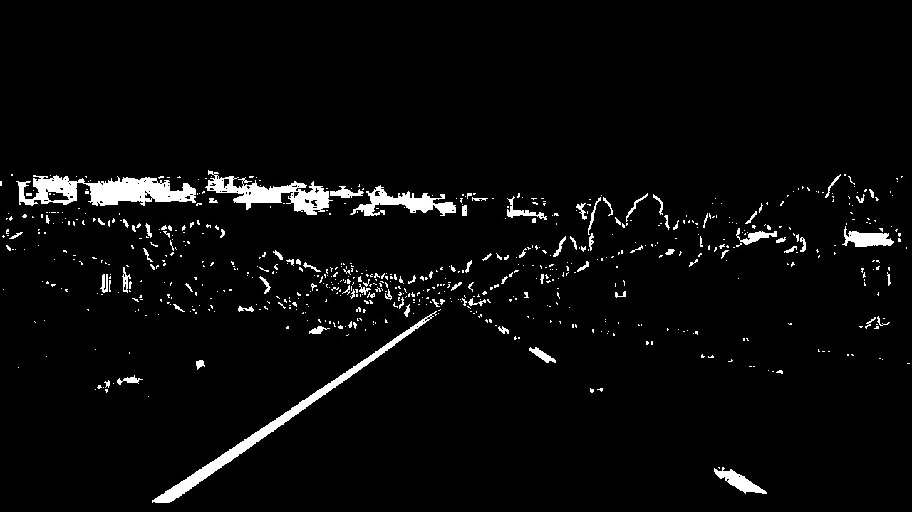</tr>
<tr><td></td><td>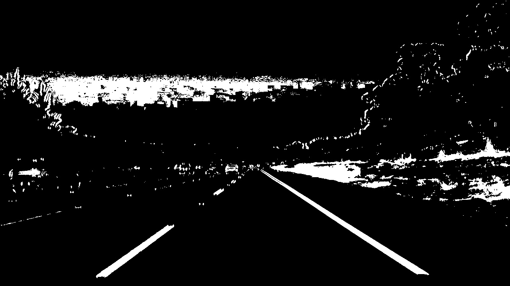</tr>
<tr><td></td><td></tr>
<tr><td></td><td>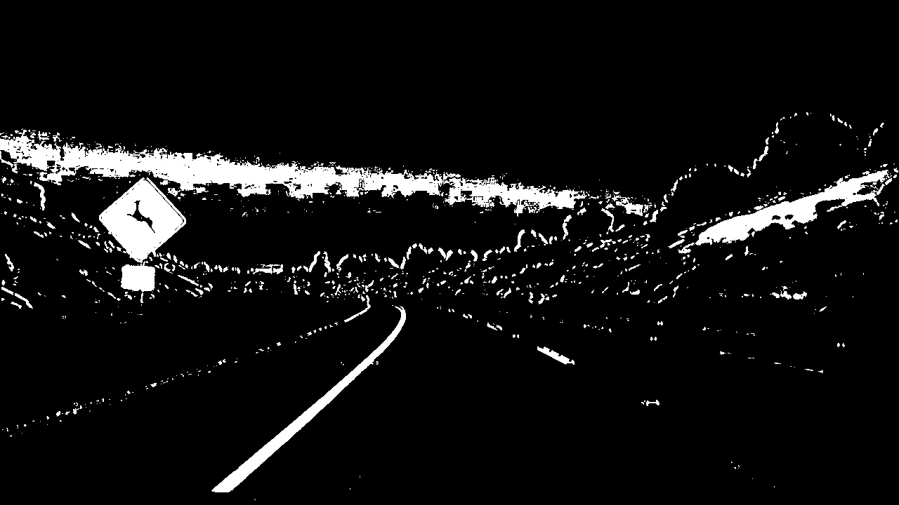</tr>
<tr><td></td><td>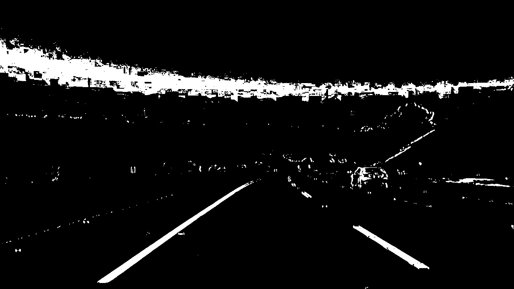</tr>
<tr><td></td><td>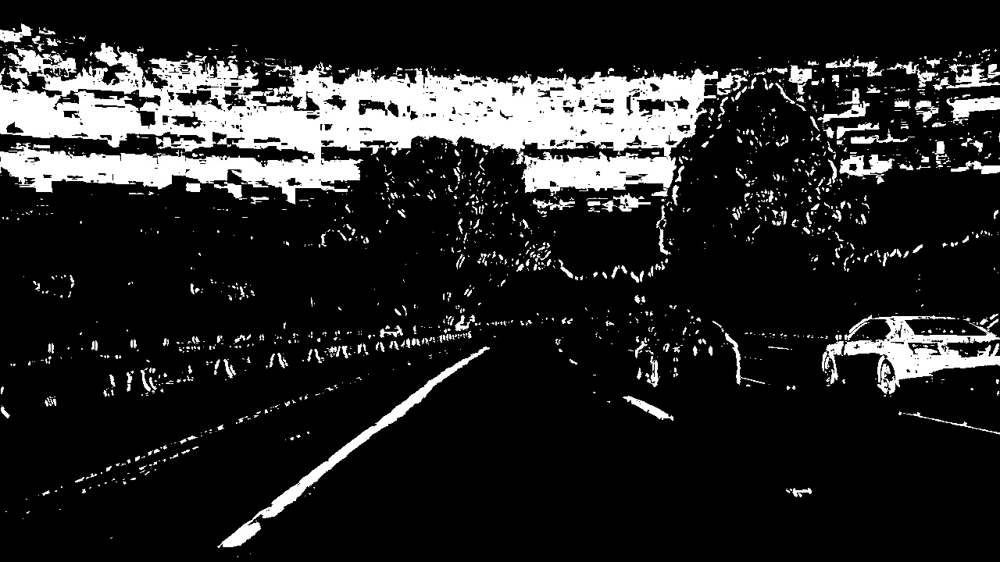</tr>
<tr><td></td><td>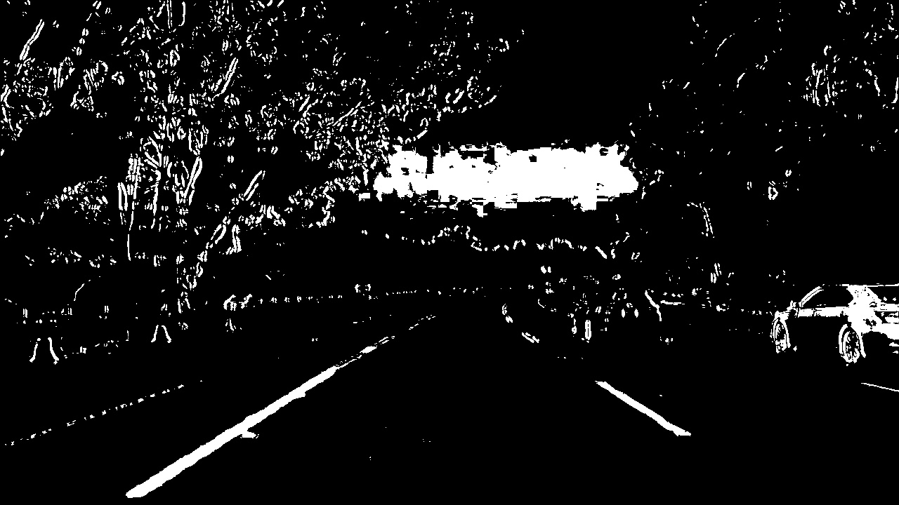</tr>
<tr><td></td><td>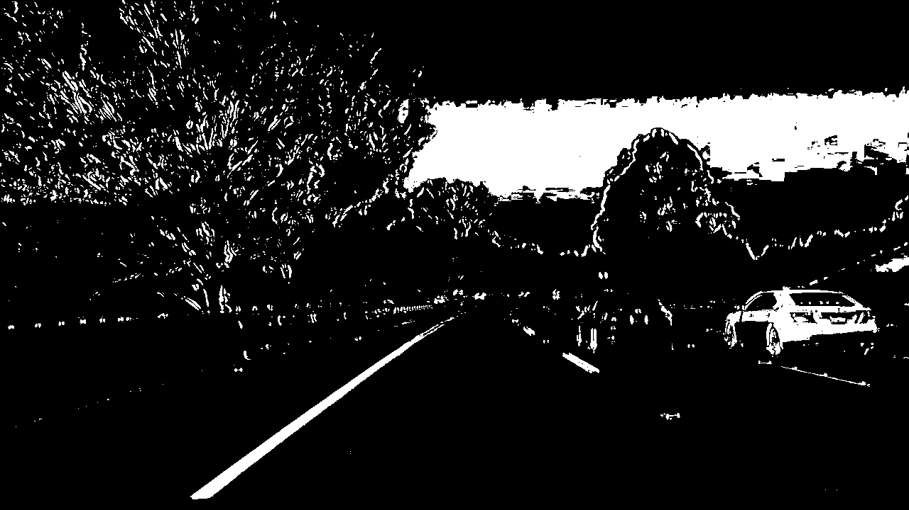</tr>
</table>

To figure out what is the best combination of image transformations I did a lot of tests applying them to all test images. You can see it in ipynb file, section 3.2.

## 4. Apply a perspective transform to rectify binary image ("birds-eye view"). ##

The OpenCV library has built-in functions for perspective transformations, so I had only to find an image with straight lines, manually mark four reference points and tell OpenCV to find a matrix transforming them into rectangle. I decided to keep the output image size the same and let 300 pixel margins on the left and right sides of the warped image.

Here is my reference image:
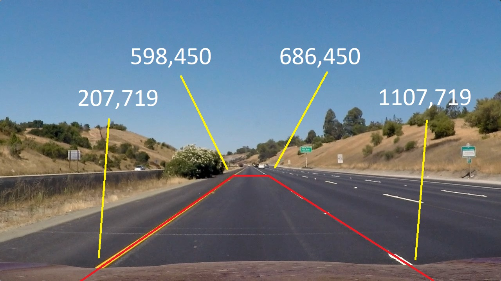

And here the same image after applying the transformation:
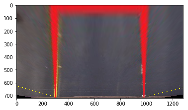

## 5. Detect lane pixels and fit to find the lane boundary. ##

To get polynomial approximation of lane lines I used histogram peaks finding algorithm as proposed in Udacity chapter 33.

The algorithm is sensible to picture quality in the bottom sid of the image, so I spend a lot of time refining binarization of images described above. Really my workflow was:

1. Choose color transformations, their combinations and thresholds
2. Pre-process test images
3. Check  if lines are clearly visible on all images
4. Repeat

The algorithm first uses histogram to detect two peaks in the bottom part of the image and then goes up steps detecting pixels in windows. Initial window position is based on previous results and is then re-centered based on the mean position of found pixels.
See code block 5. I took it directly from the Udacity materials.

The next step was more interesting. Once we know approximate line position, it's enough to take white pixels in a corridor of 100 pixles left and right to the line and apply the Numpy polyfit function to find the best fitting polynomial coeffecients.
The function find_lines_incremental is much easier to read and understand. 

Both find_lines_with_histogram and find_lines_incremental functions try to estimate the quality of results. That value will be used later to drop outliers.
As a simplest estimation I count the number of white pixels that were used for polynomial approximation. If it was done with 1000 or more pixels the quality is considered to be 100%.

The code is in blocks 5.2 and 5.3. To test it I first use find_lines_with_histogram and then apply find_lines_incremental to the same image. As expected, both functions return very close values.

The visulization code from Udacity uses a smart combination of Numpy functions that are very efficient on multicore CPUs. It's fast, but not very readable for juniors in Python. In code block 5.3 I provide my own function to draw detected lines that uses two nested loops. It's slow and takes almost 2 seconds to calculate single image, but I find it be more readable. 

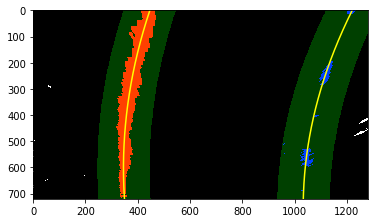 

## 6. Determine the curvature of the lane and vehicle position with respect to center ##

It's hard to say how big in the real world is the rectangle I used for bird-eye transformation, so I estimated it to be 50 meters long and 3.7 meters wide. Then I apply curvature calculation formula to estimate the curve radius. I do not know how to pu LaTeX blocks in Markdown files, but you can check it in my project Jupyter Notebook.

The calculation of lane curvature and vehicle position are incapsulated in the FrameInfo class that I will use a lot in video processing.

See code block 6.

## 7. Warp the detected lane boundaries back onto the original image. ##

In step 4 I calculated transformation matrix to covert source image into a bird-eye view. If I swap its arguments, it returns me the inverse matrix that I can use to transform values back into source image coordinates.
   
The function draw_measurement calculates marking lines coordinates using polynomial approximation and draws the resulting lane polygon back on the source image.

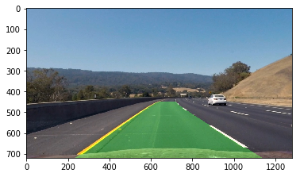

## 8. Show numerical estimation of lane curvature and vehicle position ##

Finally I use OpenCV function putText to print lane radius and vehicle position on the upper part of the source image.

See function map_lane in the code block 8.

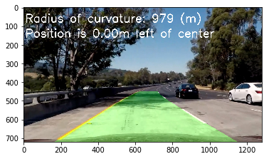

## 9. Generate video with the pipeline designed above. ## 

Once I got the pipeline working, I took the code from my previous project CarND-LaneLines-P1 to apply it to every frame in the project video. The result is checked-in in file project_video_output.mp4.

The frame processing code uses low pass filter to reduce jitter. It also tries to use faster incremental line finding algorithm if data quality from previous frame is estimated to be 90% or better.

In case of unrealistic outputs like line coordinate more than 1000 pixels away from the image center, the frame is treated as outlier and does not contribute to the coordinate change. I also save outliers in file system for further analysis. That helped me to find combination of color transformations that detect lines on all frames of project video. The optional challenge video is more challenging and here I currently get 78 outlier frames from 485 (success rate 84%).

<video width="1280" height="720" controls>
  <source src="project_video_output.mp4">
</video>  

## 10. Possible improvements ##

### Search for lanes on a "flat" image ###
I think the most will bring applying gradient detection to the bird-eye image instead of applying it before warping as required in this project. That will allow more smart filtering based on gradient direction. Current filtering based only on direction without considering pixel position is not so efficient.

Also using warped images will provide aproximatelly the same line width in all parts of the image, which will allow better choosing Sobel kernel size.         

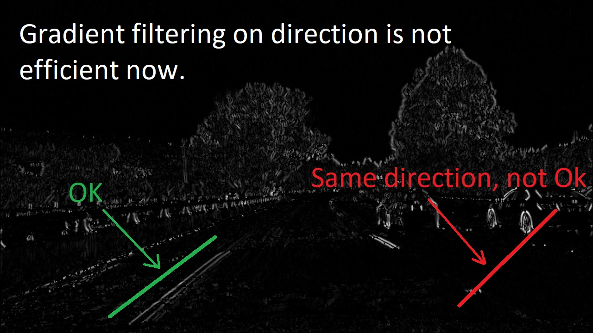

### Preventing false positives ###

Exploring outlier images from the challenge video I noticed my algorithm falsely detecting dark lines on the road. I think the solution would be the AND combination of gradient and grayscale images. Gray images are not suitable for line detection in light areas, but at least they can provide information about dark spots that are definitely not lane markers.

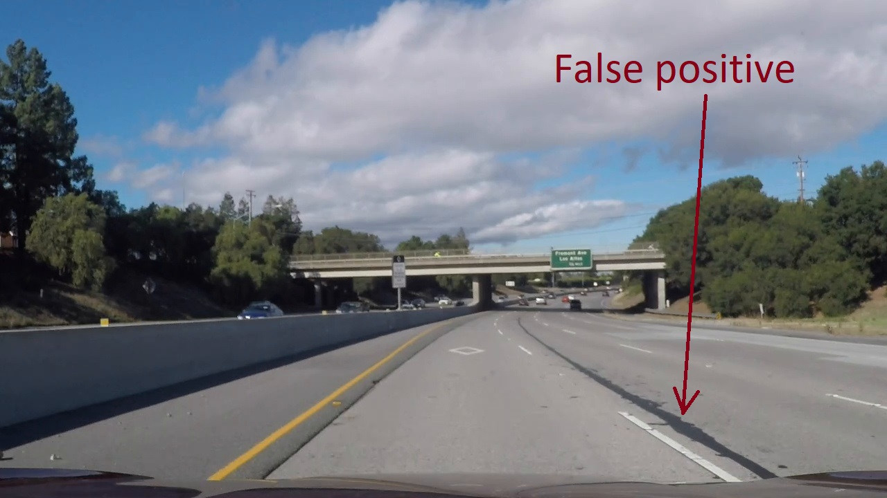
       

 
   

 
  

  

            